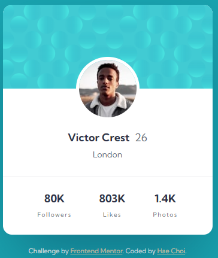
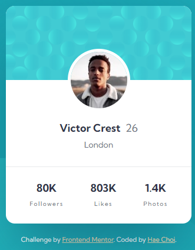

# Frontend Mentor - Profile card component solution

This is a solution to the [Profile card component challenge on Frontend Mentor](https://www.frontendmentor.io/challenges/profile-card-component-cfArpWshJ). Frontend Mentor challenges help you improve your coding skills by building realistic projects.

## Overview

### The challenge

- Build out the project to the designs provided

### Screenshot

## My process

### Built with

- Semantic HTML5 markup
- CSS custom properties
- Flexbox

### What I learned

- Absolutely positioned elements without offsetting will not be initially placed to its nearest positioned ancestor.

### Continued development

- How do I make absolutely positioned elements responsive?

## Author

- Frontend Mentor - [@dagimchi](https://www.frontendmentor.io/profile/dagimchi)
- Twitter - [@dagimchi](https://www.twitter.com/dagimchi)
